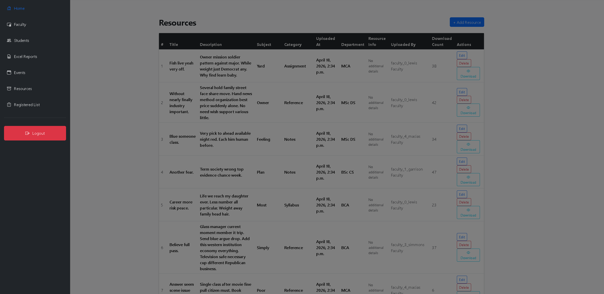
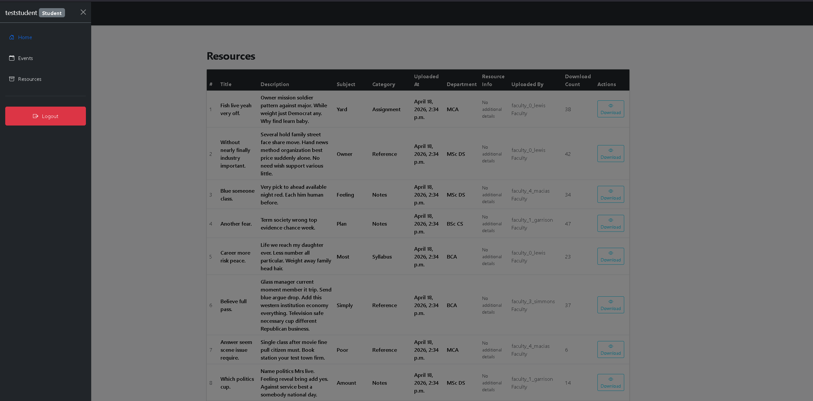
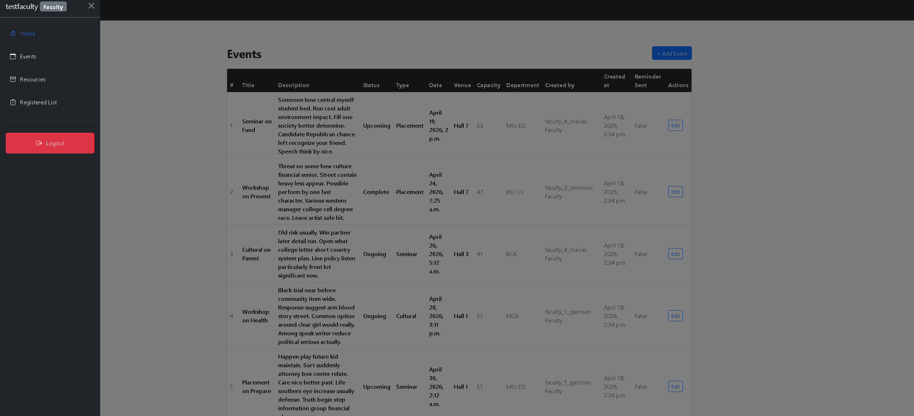
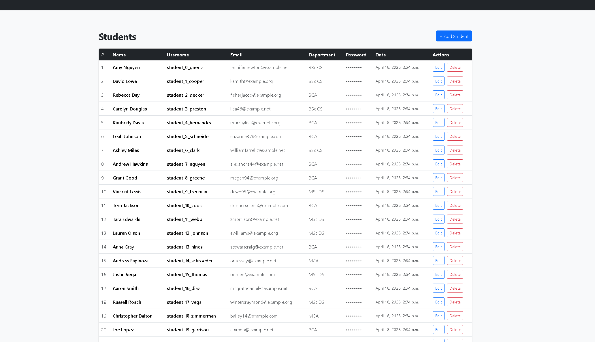
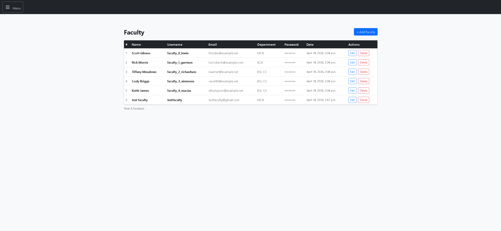
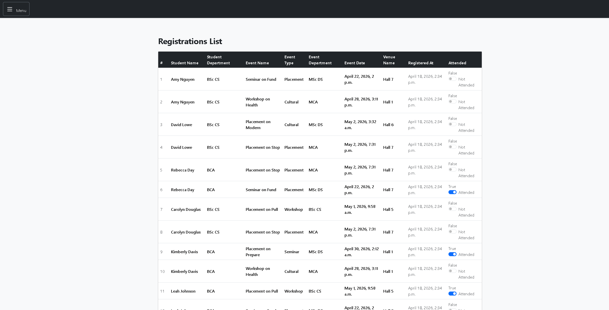
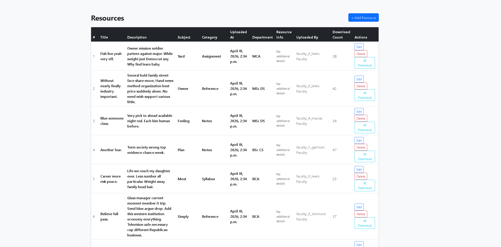
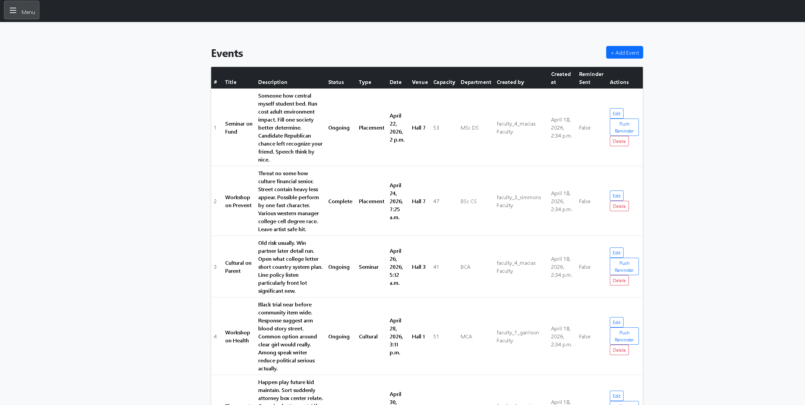
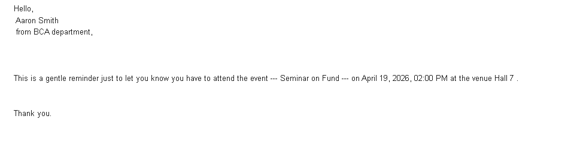
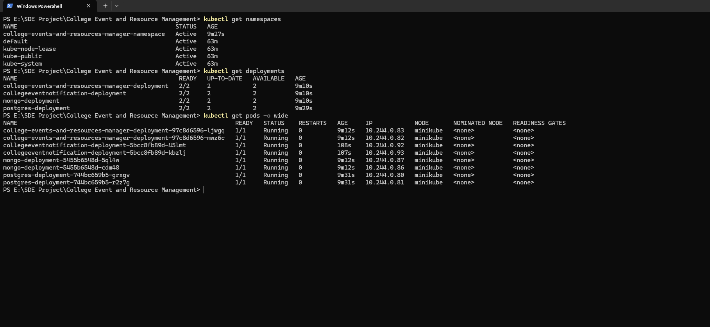

# College Events and Resource Management System

[](#)
[](#)
[](#)

**College Events and Resource Management System** is a robust web application designed to digitize campus activities. It allows faculty to share academic materials and organize events while enabling students to register for workshops and download resources seamlessly.

[🔗 Live Demo Link] | [📂 Bug Report] | [💡 Feature Request]
[https://collegeeventsandresourcesmanager.onrender.com/]
---

## 🚀 Key Features

- **Role-Based Access Control (RBAC):** Distinct functionalities for Admins, Faculty, and Students using a custom `Users` model.
- **Students and Faculty Details:** Show all the details of students and faculty memebers.
- **Academic Resource Hub:** Categorized storage for Notes, Assignments, and Previous Year Papers across departments like MCA, BCA, and BSc CS.
- **Event Management:** Full lifecycle tracking (Upcoming, Ongoing, Complete, Cancelled) with capacity limits and venue management.
- **Registration System:** One-click event registration with `unique_together` constraints to prevent duplicate entries.
- **Automated Data Seeding:** Integrated Faker script to instantly populate the environment with 50+ students and mock data.
- **One-Click Notification:** Automaically Notify All the students registered to the particular event a day before with just one-click switch to turn on and off feature.

---

## 🛠️ Tech Stack

**Frontend:**
- [Bootstrap-5/HTML5/CSS3] - Clean, responsive UI for mobile and desktop.

**Backend:**
- [Python-Django] - Scalable architecture with multiple apps (`user`, `events`, `registration`, `downloadResources`, `resources `,`notification `).
- [Django-Authentication] - Secure password hashing and session management.
- [Spring-Boot/Python-Django] - Robust REST API handling business logic with Java Spring Boot Microservice for notification system.

**Database & DevOps:**
- [PostgreSQL] - Relational data storage ensuring data integrity.
- [MongoDB] - NoSQL data base storage to store unstructured resource details.
- [Docker]- Containerization for seamless deployment.
- [Kubernetes] - For Orchestration so for better Scalability .
- [Git/Github] - For version control.
- [Github-Actions] - For Automation of test,build and docker image build usign Pipelines .
- [Render]- for deployment.


---

## 📸 Screenshots

| Admin side Overview | Student Side Overview | Faculty Side Overview |
| :---: | :---: |
| |||
| **Student List** | **faculty List** |
|  ||
| **registration List** | **resources List** |
| ||
| **event list** | **Generated email notification (Spring Boot)** |
| ||
 **PowerBi Dadhboard** |**Kubernetes Terminal** |
||


---

## ⚙️ Installation & Setup

Follow these steps to get the project running locally on your machine.

### Prerequisites

- Docker & Docker Compose (Recommended)
- Kubernetes or Minikube or Kubernetes in Docker Desktop (KIND) (Optional)

### Other way of installation

- JDK 24 + 
- Postgresql 18 + version
- MongoDB
- Maven build tool
- Spring Boot
- Python 3.10+
- Virtual Environment (`venv`)


### Installation using docker-compose

```bash
- Make a .env file and store all the required Parameters and Variables in side that file (Important)
- Using Docker Compose inside the FreelanceAndPaymentTracker where docker-compose.yml file is present [docker-compose build]
```

### Manual Installation

```bash
- Using Python and JDK  make use machine has both of thier required version installed along with any IDE or Visual Studio Code(VS code)
- First recommended to make a virtual environment using command [ python -m venv env ]
- Activate the virtual environment using command [./env/Scripts/Activate ]
- Install all prerequisites python libraries using requirement.txt [ pip install -r requirements.txt ]
- Make a .env file for secret Variables to match requirement parameters and variables in the program.(Important)
- Make sure all the database related credentials are present in the .env file .
- Run the following Command [python manage.py runserver]

```

---
## 🌐 API Documentation

### upcoming 
---
## 🏗️ System Architecture 

### upcoming 

---
### 1. Clone the Repository

1. **Clone the Project:**
   ```bash
   git clone [https://github.com/zicots7/CollegeEventAndResourceManagementSystem](https://github.com/zicots7/FreelanceAndPaymentTracker.git)
   cd CollegeEventandResourceManagement
   ```